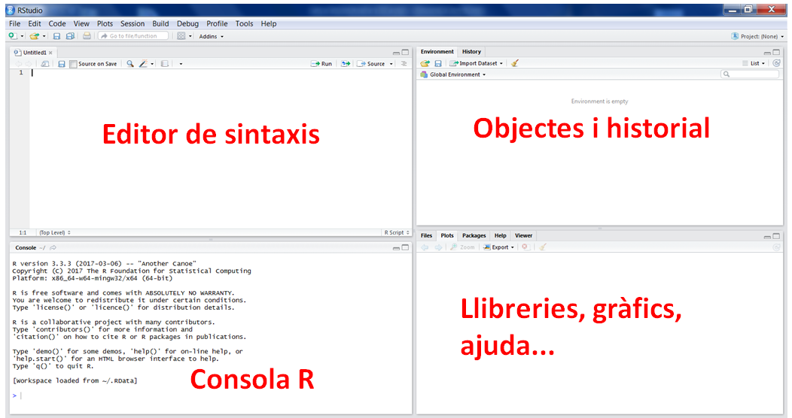

# Estructura del curs

## Classe 0: Què és R 

\bgroup
\hypersetup{linkcolor = red}
\listoffigures
\egroup

- Detalls del curs
- Descarregar i instal·lar R
- Descarregar i instal·lar RStudio
- Què és R
- Què és i com s'utilitza RStudio

## Classe 1: Introducció a R

- Objectes de R: vectors, matrius, llistes i dataframes

- Operacions en R

- Instal·lació de paquets i llibreries.

- Importació/ Exportació de dades.

- Operacions habituals de tractament de dades.

- Gràfics simples

## Classe 2: Markdown
- Markdown
- Espais de treball

## Classe 3: Estadística bàsica
- Test d'hipòtesi
- Implementació en R

## Classe 4: Errors i missings
- Identificació i tractament d'errors
- Identificació i tractament de missings

## Classe 5: Models predictius
- Regressió lineal
- Regressió logística
- Avaluació de models
- Corbes ROC i AUC

## Classe 6: Selecció de model
- Bias-variance tradeoff
- Overfitting i underfitting
- Forward subset selection
- Lasso

## Classe 7: Gràfics
- Utilització de ggplot2

#  Classe 0

## Fonts test d'hipòtesi

La part de test d'hipòtesi no la cobreixen, aquesta està basada en el llibre:

> Statistics, An introduction using R, de Michael J. Crawley

Tant en els llibres com en els vídeos hi ha moltíssima més informació de la que farem en el curs i és un lloc fantàstic pels que vulguin ampliar.

Un altre llibre que us pot interessar és "Discovering Statistics Using R", de Andy Field i altres. És un molt bon compendi i un lloc d'on treure llibreries útils.

## Fonts models predictius

Aquesta classe està basada en les classes de Trevor Hastie i Rob Tibshirani (Stanford University) i en el llibre "An Introduction to Statistical Learning with Applications in R" 

Podeu trobar les classes aquí:

https://www.r-bloggers.com/in-depth-introduction-to-machine-learning-in-15-hours-of-expert-videos/

I el llibre està penjat gratuïtament aquí (també és a la biblioteca): 

http://www-bcf.usc.edu/~gareth/ISL/

## Fonts models predictius

De totes les classes que hi ha, farem:

- Lab: Introduction to R del capítol 2

- Lab: Linear Regression 

- Lab: Logistic Regression  dels capítols 3 i 4)

- Lab: Forward Stepwise Selection and Model Selection Using Validation Set (tema 6)

- Lab: Model Selection Using Cross-Validation (tema 6)

- Evidentment també són útils les parts teòriques relacionades amb les pràctiques dels vídeos

## Obtenir informació i ajuda

Llocs on treure informació sobre llibreries, tutorials o demanar ajuda:

**Tutorials**: https://www.statmethods.net/index.html, https://www.r-bloggers.com

**Documentació**: https://cran.r-project.org/manuals.html

**LLibreries** (exemple): https://cran.r-project.org/web/packages/lme4/lme4.pdf

**Demanar ajuda**: https://stackoverflow.com (prgramar)

**Demanar ajuda**: https://stats.stackexchange.com/ (estadística)

Per qualsevol altra cosa, google.

Aquesta classe la podeu trobar actualitzada a 

> https://github.com/ecorreig/Curs-R

## Introducció

- R és un potent i flexible programari pensat per tractar dades, fer gràfics i anàlisis estadístics. 

- També és un llenguatge de programació amb funcions orientades a objectes.

- És programari lliure i funciona sota Windows, MAC OS i Linux.

## Baixar i instal·lar R

R és un llenguatge de programació, però s'instal·la a l'ordinador com qualsevol altre programa.
El podeu trobar a:

> https://cran.r-project.org/

On trobareu versions per linux, mac i windows. 

Baixeu-vos l'última versió disponible, que en el moment d'escriure aquest text és la 4.5.1.

Seguiu després les instruccions per instal·lar-lo al vostre ordinador. 

## RStudio

Una vegada instal·lat R ja el podem utilitzar, el que passa és que és difícil d'utilitzar com a tal, i per això fem servir un IDE (Entorn integrat de desenvolupament (en anlgès)), que bàsicament ens facilita la vida a l'hora de programar

L'IDE més utilitzat per R és RStudio, i és el que nosaltres utilitzarem. El podeu trobar a:

**mac**: https://medium.com/@GalarnykMichael/install-r-and-rstudio-on-mac-e911606ce4f4

**Windows**: https://medium.com/@GalarnykMichael/install-r-and-rstudio-on-windows-5f503f708027

**LINUX**: https://medium.com/@GalarnykMichael/install-r-and-rstudio-on-ubuntu-12-04-14-04-16-04-b6b3107f7779

Seguiu també les instruccions per instal·lar-lo.

## { width=7% } Studio

## Dialectes d'R

R té el que s'anomena un dialecte, que és el conjunt de funcions i llibreries que s'utilitzen en el llenguatge i que segueixen la mateixa filosofia.

Nosaltres farem servir el dialecte "tidyverse", creada per Hadley Wickham i altres, i que es basa en oferir una manipulació de dades ordenada i el que se'n diu "opinionada", és a dir, que redueix la flexibilitat per homogeneitzar l'ús i reduir els errors.

## Fi

\center
\Large

Final de la classe 0.

