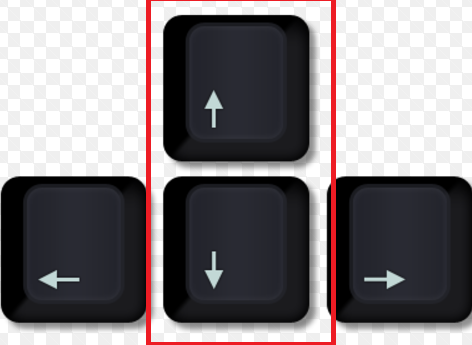
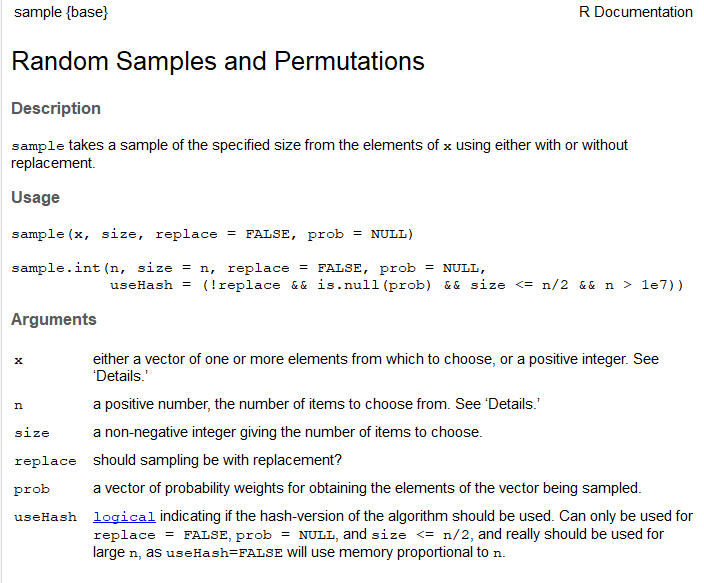

# Primera sessió amb R

## Baixar i instal·lar R

R és un llenguatge de programació, però s'instal·la a l'ordinador com qualsevol altre programa.
El podeu trobar a:

> https://cran.r-project.org/

On trobareu versions per linux, mac i windows. 

Baixeu-vos l'última versió disponible, que en el moment d'escriure aquest text és la 4.5.1.

Seguiu després les instruccions per instal·lar-lo al vostre ordinador. 

## RStudio

Una vegada instal·lat R ja el podem utilitzar, el que passa és que és difícil d'utilitzar com a tal, i per això fem servir un IDE (Entorn integrat de desenvolupament (en anlgès)), que bàsicament ens facilita la vida a l'hora de programar

L'IDE més utilitzat per R és RStudio, i és el que nosaltres utilitzarem. El podeu trobar a:

**mac**: https://medium.com/@GalarnykMichael/install-r-and-rstudio-on-mac-e911606ce4f4

**Windows**: https://medium.com/@GalarnykMichael/install-r-and-rstudio-on-windows-5f503f708027

**LINUX**: https://medium.com/@GalarnykMichael/install-r-and-rstudio-on-ubuntu-12-04-14-04-16-04-b6b3107f7779

Seguiu també les instruccions per instal·lar-lo.


## { width=7% } Studio

{ width=90% }

## Consola

- Aquest símbol ">" és el prompt i és on haurem d'escriure les nostres ordres.

- Aquest símbol "#" serveix per introduir un comentari.


## Consola

- Si ens equivoquem podem pitgem la tecla "ESC" i tornarà a aparèixer el símbol ">"

- Podem navegar per les instruccions que ja hem executat fent servir les tecles  { width=10% }

- Per sortir del programa podem tancar o executar ">q()"

## Paquets i les llibreries

- R consta d'un sistema "base", que inclou molts mètodes estadístics, i un sistema per paquets que permeten anar molt més enllà.

- A sobre d'aquí, hi ha conjunts de paquets que s'anomenen dialectes, que són conjunts de paquets que segueixen la mateixa filosofia.

- Finalment, hi ha paquets amb eines extres que s'anomenen "llibreries", i que instal·larem quan ho necessitem.


## Paquets i les llibreries

Triem un repositori: 

```{r , eval=FALSE}
install.packages("readr") # Importar dades de text
```

Un cop instal·lat l'haurem de carregar a la biblioteca:

```{r , eval=FALSE}
library(readr)
```

## Llenguatge interpretat

- R és un llenguatge interpretat, per això no cal compilar.

- Per executar una ordre, només cal escriure-la i pulsar "Enter".

- Exemples:

```{r}
4 + 5

sqrt(49)

log(2)
```

## Funcions

- Una funció és un conjunt d'ordres que es poden executar amb un sol nom.

- Per exemple, la funció `sqrt()` calcula la arrel quadrada d'un nombre.

- Les funcions tenen paràmetres, que són els valors que li passem per a que la funció funcioni.

- Els paràmetres poden ser:

- **Obligatoris**: són els que no tenen valor per defecte i s'han de posar.

- **Opcionals**: són els que tenen valor per defecte i s'han de posar si volem canviar el valor per defecte.

## Funcions

Per exemple, la funció `sqrt()` té un paràmetre obligatori, que és el nombre del qual volem calcular l'arrel quadrada.

```{r}
sqrt(49)
```

- Per exemple, la funció `rnorm()` té dos paràmetres opcionals, que són el nombre de nombres aleatoris que volem generar i la mitjana i la desviació estàndard de la distribució normal.

```{r}
rnorm(3, mean = 0, sd = 1)
```

## Funcions

Els paràmetres es poden passar per posició o per nom.

```{r}
rnorm(3, 0, 1)
rnorm(n = 3, mean = 0, sd = 1)
```

## Funcions: ajuda

Imaginem que volem saber més sóbre les funcions de distribució normals en R, escrivim:

```{r, eval = F}
?sample
```

- Ens surt una informació com aquesta: 

{ width=70% }

## Funcions: ajuda

- Hi ha informació sobre diverses funcions, amb tots els paràmetres explicats. 
- Com veiem, les funcions a R sempre van amb el nom i parèntesis després on, si cal, hi poso els arguemnts (no s'ha de confondre amb les subseleccions, que van amb claudàtors).
- Important: els paràmetres que no tenen signe "=", per exemple x, q, p o n, són *obligatoris*
- Els que sí que tenen un signe "=", per exemple, mean o sd són opcionals i tenen valor per defecte el valor que trobem deprés de l'=. Per exemple el *valor per defecte* de la mitja és 0 i el de la desviació estàndard és 1. 


## Espai de treball

- És l'espai on es desen tots els objectes que anem creant o carregant.
- Quan tanquem el programa el podem desar.


```{r , eval=FALSE}
getwd() #on és el meu espai de treball
ls() #quins objectes hi ha?

setwd("PATH") # hem de substituir el "path" pel de l'espai de 
# treball on volem estar
```


# Objectes

## Variables

- Les variables són els objectes més simple i poden ser:

1. numèric: números reals (3.1415)

1. complex: números complexes (2 + 5i)

1. character: cadenes alfanumèriques de text ("patata")

1. factor: variables categòriques (sexe, color, etc.)

1. logical: variables lògiques (TRUE) 

## Objectes

- Els objectes són elements que es guarden en l'espai de treball (és a dir, en la memòria RAM).
- Un objecte pot contenir un o més elements.

```{r}
w <- 3 + 4 # Creem l'objecte w
print(w)

```

## Tipus d'objectes

- Bàsicament podem identificar 4 tipus d'objectes:

1. Vectors
2. Matrius
3. Dataframes
4. Llistes

En aquest curs treballarem vectors i dataframes.


## Tipus d'objectes: vectors
\tiny

- És una col·lecció ordenada d'elements del **mateix tipus** (numèric, factor...)
- Es creen amb la funció c()

```{r }
x <- c(2, 4, 6) # Vector de 3 elements numèrics parells
x
y <- c("A", "B", "C") # Vector de 3 elements cadena
y
z <- c(TRUE, FALSE, TRUE) # Vector de 3 elements lògics
z
```

## Algunes operacions: vectors
\tiny
```{r}
x <- 1:10 # Genera un vector d'1 a 10
x
x[4] # La posició 4 és

x[x > 7] # Elements més grans de 7

x + 2 # Sumar un nombre
```

## Tipus d'objectes: dataframes

- És una col·lecció ordenada d'elements de **qualsevol tipus** amb dues dimensions.

\tiny
```{r}
library(tibble)

id <- 1:10

sexe <- rep(c("M", "D"), 5)

normal <- rnorm(10)

curacio <- rep(c(FALSE, TRUE), 5)

dades <- tibble(id, sexe, normal, curacio)

head(dades) # Mostrar primeres files/registres

```

# Manipulació de dades

## Introducció

Ara utilitzarem les funcions del paquet **dplyr** per fer les subseleccions més habituals.  
Algunes de les funcions bàsiques són:

* `select()` – escull columnes  
* `slice()` – escull files per posició  
* `filter()` – escull files que compleixen una condició  
* `arrange()` – ordena files  
* `mutate()` – crea o transforma variables

Això ho farem amb el paquet 'dplyr'

```{r, message=F}
library(dplyr)
```

## Subseleccions

```{r}
# Seleccionem una cel·la concreta: fila 2
slice(dades, 2)

# Seleccionem una fila, per exemple de la 4 a la 10
slice(dades, 4:10)

# També ho podem fer pel nom de la variable
select(dades, normal)

# També ho podem fer amb el símbol del dòlar "$"
dades$normal
```


## Subseleccions

```{r}
# Seleccionem un conjunt de columnes
select(dades, id, sexe, normal)

# O totes menys algunes
select(dades, -id, -normal)
```

## Subseleccions

```{r}
# Creem un nou objecte amb la subselecció
dades2 <- select(dades, id, sexe, normal)

head(dades2)
```

## Filtres

```{r}
# Subseleccionar amb una condició lògica
dones <- filter(dades, sexe == "D")
head(dones)

# Un altre exemple
grans <- filter(dades, normal > 1.96)
head(grans)
```

## L'operador pipe

L'operador pipe `|>` ens permet **encadenar** funcions de manera llegible:

- Passa el resultat de l'esquerra com a **primer argument** de la funció de la dreta
- Ens estalvia crear variables intermèdies
- Fa el codi més llegible i natural
- També es pot escriure com a '%>%', són equivalents però lleugerament diferents.

## L'operador pipe

Exemple:

**Sense pipe:**
```{r, eval=FALSE}
resultat <- select(filter(dades, sexe == "D"), id, normal)
```

**Amb pipe:**
```{r, eval=FALSE}
resultat <- dades |>
  filter(sexe == "D") |>
  select(id, normal)
```

Es llegeix com: "agafa `dades`, després filtra per sexe femení, després selecciona id i normal"


# Llegir dades externes

## Paquets del tidyverse per a la lectura de dades

- **readr** : fitxers de text (\*.csv, \*.tsv, \*.txt …)  
- **readxl** : fulls de càlcul Excel (\*.xls, \*.xlsx)  
- **haven** : fitxers d'altres programes estadístics (SPSS, Stata, SAS)

Totes aquestes funcions retornen un **tibble** i encaixen a la perfecció amb la resta del flux `tidyverse`.

```{r, message = FALSE}
library(readr)  # read_csv(), read_delim(), …
library(readxl) # read_excel()
library(haven)  # read_spss(), read_dta(), read_sas()
```

### Importar fitxers de text (.csv, .tsv, …)

```{r, eval=FALSE}
# Fitxer CSV amb separador ","
dades <- read_csv("ruta/fitxer.csv", show_col_types = FALSE)

# Fitxer delimitat per punt i coma
dades <- read_delim("ruta/fitxer.csv", delim = ";", show_col_types = FALSE)

# o
dades <- read_csv2("ruta/fitxer.csv")

# Fitxer delimitat per tabulador
dades <- read_tsv("ruta/fitxer.tsv")
```

### Importar fitxers Excel

```{r, eval=FALSE}
full <- read_excel("ruta/fitxer.xlsx", sheet = "Full1")
```

### Importar fitxers SPSS / Stata / SAS

```{r, eval=FALSE}
enc   <- read_spss("ruta/dades.sav")      # SPSS
stata <- read_dta("ruta/dades.dta")       # Stata
sas   <- read_sas("ruta/dades.sas7bdat") # SAS
```

### Exemple

```{r}
# Llegim les dades d'exemple amb readr
dades <- read_csv("data/dades.csv", show_col_types = FALSE)
```

# Exploració de les dades

## Estructura

Fem una ullada a les dades

```{r, eval=T}
str(dades) # mostra estructura d'un objecte
```

## Estructura

```{r}
glimpse(dades) # forma de tidyverse
```

## Primeres / últimes files

```{r, eval=T}
head(dades) # mostra les primeres files

tail(dades) # mostra les últimes files
```


## Tota la taula (en una finestra nova)

```{r, eval=FALSE}
View(dades) # mostra tot el conjunt de dades 
```

# Manipulació de variables

## Creació de noves variables

Fem servir `mutate()` per afegir columnes al nostre tibble:

```{r}
dades <- dades |> 
  mutate(
    alçada_metres = alçada / 100,
    imc    = pes / alçada_metres ^ 2   # índex de massa corporal
  )
```

## Visualitzem

```{r}
head(dades)
```

## Recodificació de variables

Podem crear una variable categòrica a partir de `imc` amb `case_when()` (o bé `cut()` si ho preferim):

```{r}
dades <- dades |>
  mutate(
    imccat = case_when(
      imc < 18 ~ "baix pes",
      imc < 25 ~ "normal",
      imc < 30 ~ "sobrepes",
      TRUE ~ "obesitat"
    ) 
  )
```


## Factors

Els factors són un tipus de variable especial en R que serveix per representar dades categòriques. Són molt útils per:

- Representar variables qualitatives (nominal o ordinal)
- Mantenir un ordre específic en les categories
- Fer anàlisis estadístics i gràfics

## Factors

Per treballar amb factors, el paquet `forcats` (part de tidyverse) ofereix moltes funcions útils:

```{r}
library(forcats)

# Convertim imccat a factor i ordenem els nivells
dades <- dades |>
  mutate(
    imccat = fct_relevel(
      imccat, "baix pes", "normal", "sobrepes", "obesitat")
  )

# Comprovem els nivells
levels(dades$imccat)
```


## Transformació de variables

Algunes funcions útils per canviar el tipus d'una columna dins de `mutate()`:

- `as.numeric()`
- `as.character()`
- `as.factor()`

```{r}
# Exemple: convertim una columna character a numèrica
dades <- dades |> 
  mutate(alçada_num = as.numeric(alçada))
```

## Transformació de variables

Compte quan convertim factors directament a numèrics; sovint convé passar per `as.character()`:

```{r}
levels_ex <- factor(c("1", "10", "5"))
# Conversió incorrecta:
as.numeric(levels_ex)
# Conversió correcta:
as.numeric(as.character(levels_ex))
```

## Ordenar files

\tiny
```{r}
dades |> arrange(imc) |> head(3)

dades |> arrange(sexe, desc(imc)) |> head(3)
```


# Gràfics amb { width=10% }

## Introducció

- En R hi ha moltes llibreries per fer gràfics
- R base té capacitat per fer gràfics simples
- Per gràfics més avançats la llibreria més utilitzada és "ggplot2"
- N'hi ha d'altres, com ara "plotly".
- En aquest curs utilitzarem el paquet base i ggplot2 a l'última classe.


## Funció "plot"

```{r, eval = F}
plot(x = var.x, 
     y = var.y, 
     type = "tipus",
     col = "color",
     pch = "tipus de punt",
     cex = "mida del punt",
     lwd = "amplada de la línia",
     main = "títol",
     sub = "subtítol",
     xlab = "nom de l'eix x",
     ylab = "nom de l'eix y",
     ...)

```


## Funció "plot": diagrames de caixes

- Si li passem una variable categòrica sap que ha de fer boxplots:

```{r fig1, fig.height=4}
dades <- dades |> mutate(sexe = as.factor(sexe))

plot(edat ~ sexe, dades)
```

## Funció "plot": diagrames de punts

- Si les dues variables són contínues fa un gràfic de punts:

```{r fig2, fig.height=4.5}
plot(imc ~ pes, dades, pch = 20, col = "red", cex = 2.5,
     main = "diagrama de punts", xlab = "pes", ylab = "imc")
```

## Histograma

```{r fig3, fig.height=5.5}
hist(dades$normal, main = "histograma",xlab = "imc")
```

## Dreceres de teclat útils

- `Ctrl + Alt + I` per crear un chunk

- `Alt Gr + -` per crear l'assignació `<-`

- `Ctrl + Shift + M` per crear una pipe

## Fi

\center
\Large

Final de la classe 1.

