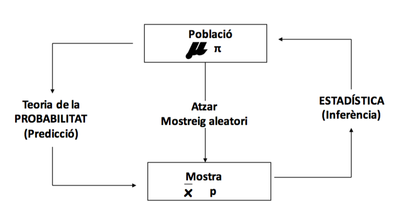

```{r setup, include=FALSE}
knitr::opts_chunk$set(echo = TRUE, warning = FALSE) # no cal tocar-ho gaire
set.seed(2901)
```

### Què és l'estadística



### Què fem en estadística

- Creem hipòtesis nules (H0) i les intentem refutar per tal d'acceptar la hipòtesi alternativa
- Quan les podem refutar?
    - Depèn de la confiança (sovint en 95%)
- **Quan la probabilitat de que la mostra vingui d'una distribució que segueix la hipòtesi nul·la sigui menor que 1 menys la confiança**
    - Si la confiança és del 95% serà quan la p < 0.05

Exemple: tenim una pastilla per baixar el colesterol i un placebo, volem demostrar que la pastilla funciona i per tant hem de demostrar que els nivells de colesterol del grup que han pres la pastilla són significativamet més baixos que els que no han pres la pastilla.

```{r}
colesterol = c(rnorm(20, mean=85, sd = 10), rnorm(20, mean = 95, sd = 14))
grup = c(rep("tractament", 20), rep("placebo", 20))
df = as.data.frame(cbind(colesterol, grup))
df$colesterol = as.numeric(as.character(df$colesterol))
df$grup = as.factor(df$grup)
plot(df$grup, df$colesterol, ylab="Colesterol", main="Comparació tractament-placebo")
```

- La pastilla funciona?

Un altre exemple: assumim que la mitja d'alçada d'aquesta classe és de 170cm i la desviació estàndard és de 10cm, quina probabilitat hi ha que entri per la porta una persona de 195cm?

Per respondre a aquestes preguntes hem de saber les probabilitats que hi ha de que aquestes mostres provinguin d'una població que compleix la hipòtesi nul·la. 

És a dir, en el cas del colesterol, hem de calcular la probabilitat de que trobem els valors observats en el cas de que la pastilla no tingui cap efecte. O dit d'una altra manera, la probabilitat de que les diferències que veiem siguin causades únicament per l'atzar. 

En el cas de l'alçada, hem de calcular les probabilitats de que una persona provinent de la mateixa població que nosaltres (investigadors, del camp, etc) tingui una alçada de 195cm.

### Com calculem aquesta probabilitat?

Per saber-ho hem de **tipificar** les mostres per trobar l'*estadístic de contrast*, és a dir, convertir els valors que tinc a una distribució coneguda, per tal de que pugui saber les probabilitats de que la meva mostra fos com a tal tot i provindre d'una població que segueix la hipòtesi nul·la. 

Mostra -> Distribució -> Posició en la distribució -> Probabilitat (p)

Com es tipifica?

- Depèn de la condició: en cada anàlisi hauré d'escollir una distribució i una "fórmula" per transformar les meves dades a aquella distribució.

Per exmeple, si assumim que les mostres de colesterol són normals i tenen variàncies homogències, en el primer exemple el nostre estadístic de contrat és la t, que és un valor de la distribució T:


Hem de colocar l'estadístic de contrast calculat amb les nostres dades en aquesta distribució i mirar a les taules les probabilitats de que el valor estigui on és, és a dir, l'àrea sota la corba més cap a fora del nostre punt (els valors més extrems del nostre punt).

La fórmula per calcular l'estadístic de contrast en aquest cas és: 

\[ t = \frac{\bar{x_A}-\bar{x_B}}{\sqrt{\frac{s_{conj}}{n_A}+\frac{s_{conj}}{n_B}}} \]

Que, amb les nostres dades, dóna: \[ t = 1.856 \]

Busquem a les taules la probabilitat de que això es doni, amb graus de llibertat: \[n_A+n_b-2\]):

[Taula de T](https://www.medcalc.org/manual/t-distribution.php)


Veiem que les probabilitats estan entre el 5 i el 10%, així que concloem que no podem abandonar la hipòtesi nul·la. 

En el segon cas, la tipificació és molt més senzilla:

\[ z = \frac{x-\mu}{\sigma} \]

Que, en el nostre cas val: \[ z= 2.5 \]

En aquest cas mirem a les taules de la distribució normal (amb graus de llibertat n-1):

[Taula de Z](http://www.stat.ufl.edu/~athienit/Tables/Ztable.pdf)

Per tant veiem que la probabilitat de que entri algú de 195cm o més és del 0,62%.

Per tant, veiem que sempre és el mateix:

Això ho condensem amb els *tests d'hipòtesi*, que fan tot aquest procediment d'una tirada:

Test d'hipòtesi <-> Mostra -> Distribució -> Posició en la distribució -> Probabilitat (p)

Ara la pregunta és: quin test d'hipòtesi he de fer servir?

### Tests d'hipòtesi


I taules!

Test | Comanda 1 | Comanda 2
-------------------- | ---------------------- | ---------------------
Chi 2 | chisq.test(x, y) | 
Fisher exact test | fisher.test(x, y) | 
Shapiro Wilk | shapiro.test(x) |
Levene | levene.test(y, group) |
T - Student | t.test(x, y) | t.test(formula, data)
T - Welch | t.test(x, y, var.equal = FALSE) | t.test(formula, data, var.equal = FALSE)
Mann-Whitney U | wilcox.test(x, y) | wilcox.test(formula, data)
T - Student aparellada | t.test(x, y, paired = TRUE) | t.test(formula, data, paired = TRUE)
Wilcoxon Signed Rank | wilcox.test(x, y, paired = TRUE) | wilcox.test(formula, data, paired = TRUE)
ANOVA | aov(formula, data) |
Kruskall Wallis | kruskal.test(x, g) | kruskal.test(formula, data)
ANOVA mesures repetides | ez::ezANOVA(data, dv, wid) |
Friedman | friedman.test(y, groups) | friedman.test(formula, data)


Exemples:
===

Anem a veure com s'utilitzen. Seguim amb el fitxer de malalties del fetge.

Quines dades teníem?
```{r}
liver = read.csv('indian_liver_patient.csv')
head(liver)
str(liver)
liver$Dataset = as.factor(liver$Dataset)
```

Imaginem que volem veure si la bilirrubina total depèn segons el sexe: 

Primer mirem si segueix una distribució normal:

```{r}
shapiro.test(liver$Total_Protiens)
```

No té una distribució normal, per tant hem de fer una U de Mann - Whitney:

```{r}
wilcox.test(Total_Protiens~Gender, data=liver)
```

La p<0.05 per tant hem rebutgem la hipòtesi nula i assumim que els nivells de "Total_Protiens" són diferents entre homes i dones ( en concret més alts pels homes).

Això és veritat?

```{r}
plot(liver$Gender,liver$Total_Protiens)
```

Visualment sembla que potser sí, tot i que no està del tot clar. 

Què passa si assumim normalitat?

```{r}
t.test(Total_Protiens~Gender, data=liver)
```

Gairebé el mateix!

Provem amb una altra variable:

```{r}
wilcox.test(Albumin_and_Globulin_Ratio~Gender, data=liver)
```

A veure?

```{r}
plot(liver$Gender,liver$Albumin_and_Globulin_Ratio)
```

Ara volem veure si estadísticament la malaltia afecta més a homes o a dones:

```{r}
table(liver$Gender, liver$Dataset)
chisq.test(liver$Gender, liver$Dataset)
```

Justet però sembla que no!

Correlacions
===

I les Albumines i els Total_Protiens estan correlacionats?

```{r}
cor.test(liver$Albumin, liver$Total_Protiens) # per més info ?cor.test
```

Clarament sí! Anem a veure-ho:

```{r}
plot(liver$Albumin, liver$Total_Protiens)
```


```{r fig1, fig.width=12, fig.height=12}
#require(GGally)
#ggpairs(liver)
```

Veient aquest gràfic, ens trobem que hi ha moltes mesures que estan molt escorades a l'esquerra; això passa molt sovint en medicina i s'ha de mirar d'arreglar. Això se sol fer traient el logaritme de la variable, en R és molt senzill:

```{r}
liver$Total_Bilirubin=log(liver$Total_Bilirubin) # d'una en una

# o totes a l'hora:
for (i in 4:7){ # iterem sobre els números de columna
  liver[,i] = log(liver[,i]) # convertim la columna a log i sobreescrivim l'antiga
}
```

```{r fig2, fig.width=12, fig.height=12}
#ggpairs(liver)
```
