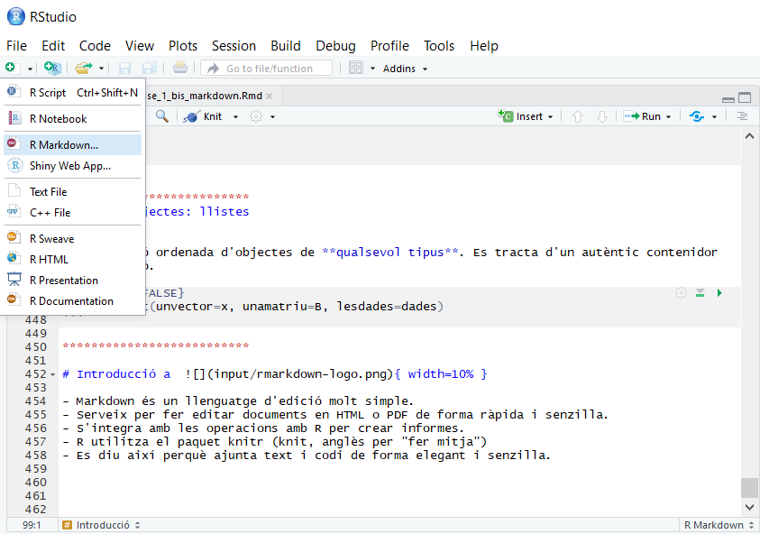
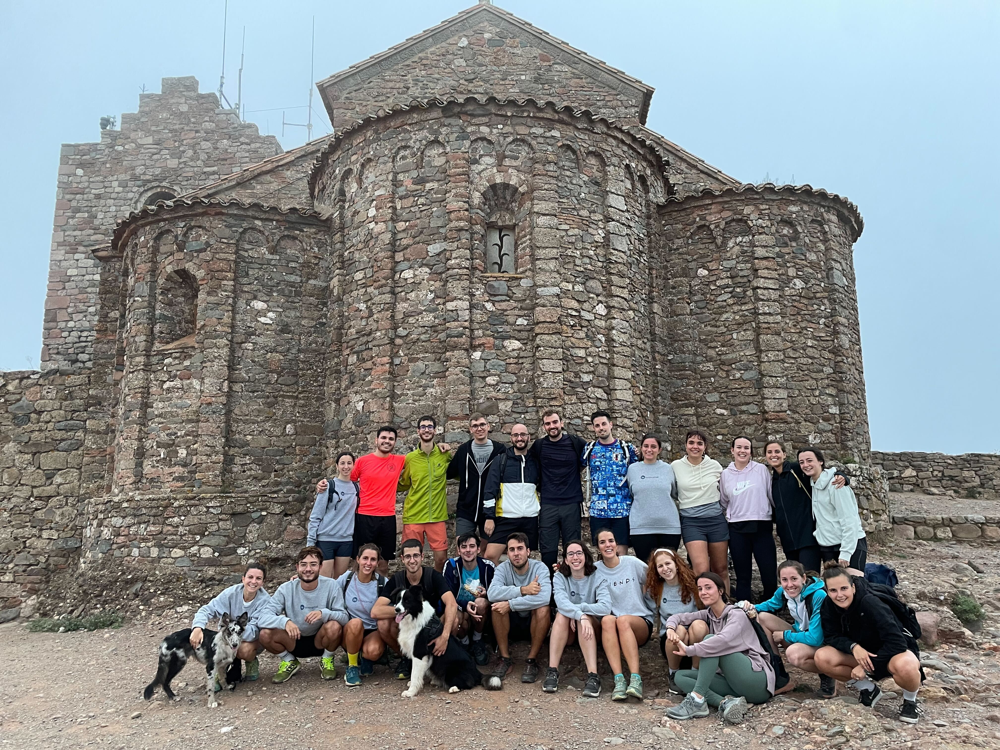

```{r setup, include=FALSE}
knitr::opts_chunk$set(echo = TRUE, message = FALSE)
```

# Què és el Markdown?

## Introducció a { width=10% }

- Markdown és un llenguatge d'edició molt simple.
- Serveix per fer editar documents en HTML o PDF de forma ràpida i senzilla.
- S'integra amb les operacions amb R per crear informes.
- R utilitza el paquet knitr (knit, anglès per "fer mitja")
- Es diu així perquè ajunta text i codi de forma elegant i senzilla.
- És reproduïble: si d'aquí 6 mesos voleu repetir l'informe, només cal apretar un botó!



# Utilització del Markdown

Aquí puc escriure el que vulgui, s'imprimirà com a text normal.

```{r}
# Aquí dins només puc escriure com si estés programant, si no em donarà error
x <- rnorm(10000)
a <- sin(pi * x)
```

Aquí puc tornar a escriure normal. Fins i tot puc fer coses com **negreta** o *cursiva*.

```{r}
library(readr)

# Puc fer que imprimeixi resultats
liver <- read_csv('data/indian_liver_patient.csv')
summary(liver)
```

També puc afegir plots:
```{r}
# o que tregui gràfics fets amb les dades:
plot(x, a)
```

Puc fer llistes:

* Un
* Dos
* Tres

I enumeracions:

1. Primer
1. Segon
1. Tercer  (sí, no m'he equivocat, el númeor del principi ha de ser sempre 1...)

I fins i tot puc fer fórmues en làtex:

\[ \sum\limits_{n=1}^{\infty} 2^{-n} = 1 \]

També puc posar links de manera molt fàcil:

[Exemple](https://innovamat.com)

I per acabar, també puc incloure imatges (evidentment, les imatges a les que fan referència han d'estar a la mateixa carpeta que el fitxer de markdown):

{ width=50% }

## Knit

- Per compilar un fitxer .Rmd, cal anar a la barra de menús i seleccionar "Knit"

- Es pot compilar a HTML, PDF o Word.

- Per defecte, es compila a HTML.

- Per compilar a PDF, cal anar a la barra de menús i seleccionar "Knit" i després "Knit to PDF".
 -> Compte, que heu d'instal·lar latex abans de poder compilar a PDF.

- Per instal·lar latex, feu servir tinytex.

```{r, eval=FALSE}
install.packages("tinytex")
tinytex::install_tinytex()
```


# Espais de treball

Per tal de fer servir Markdown de forma eficient hem d'entendre què són els espais de treball i la relació entre el del Markdown i el local. Ho expliquem a continuació:

## Espai local

L'espai de treball és el lloc de l'ordinador on treballa R; això vol dir dues coses:

La carpeta on estem treballant i on podem accedir a altres fitxers (csv, excels, spss, etc).
Les variables que hem creat (i que veiem dalt a la dreta de l'Rstudio).

Per tal de poder treballar amb fitxers externs hem de posar el nostre espai de treball a la mateixa carpeta on tinguem els fitxers. Podem veure l'espai de treball on estem ara corrent getwd() a la consola o directament ho veiem sota la paraula "Console", en gris. Si no estem a la carpeta que volem ho hem de canviar amb:

setwd("ruta") (* Recorda que això no es pot posar al markdown, només a la consola per fer-ho en local!*)

## Espai del markdown

El markdown té un altre espai de treball, que és aquell on es troba el fitxer. Per tant, la recomanació és que poseu els fitxers externs a la mateixa carpeta que el markdown i que en cap cas poseu rutes dins del markdown.

Penseu que els dos espais de treball són independents, per tant tot el que feu en local (requerir paquets, crear objectes, etc.) també ho heu de fer en el markdown!

Per altra banda, quan esteu corrent codi que està dins del markdown, però NO esteu fent "knit", això es corre el local, NO en el markdown! L'espai de treball del markdown només s'utilitza quan compilem (li donem a "knit").

## Espai de treball eteri

Si obriu el markdown, treballeu, i després moveu el fitxer els espais de treball són complicats de seguir, per tant recomanem que no ho feu mai. Tampoc treballeu mai dins d'un fitxer zip, ja que no podreu fer-hi res. Assegureu-vos d'extreure-ho tot abans de començar a fer res.


## Projectes d'RStudio

### Què és un projecte d'RStudio?

- Un projecte és un fitxer `.Rproj` que marca la **carpeta arrel** del teu treball.  
- Obrir el projecte fa que R establixi automàticament l'espai de treball (`getwd()`) a aquesta carpeta.  
- Dins del projecte queden guardades preferències (panells oberts, historial, etc.) però, sobretot, et garanteix **rutes relatives coherents**.

### Beneficis principals

1. Evites `setwd()` en els scripts/markdown: tots els camins són relatius al projecte.  
2. Mantens el codi, les dades i els resultats agrupats en una única carpeta.  
3. Pots tenir múltiples projectes oberts, cadascun amb el seu espai de treball independent.

### Projecte i espais de treball

- Quan **compiles** un `.Rmd` dins del projecte, l'espai de treball del knit parteix de la carpeta del projecte (com hem vist al bloc anterior).  
- Els scripts que executis a la consola també hereten aquest directori arrel.  
- D'aquesta manera, tot (scripts, chunks i consola) treballa sobre les mateixes rutes.

### Integració amb Git

- RStudio detecta automàticament si la carpeta té un repositori Git (`.git`).  
- Des del panell **Git** pots:  
  * Veure canvis, fer `commit`, `pull`, `push`, gestionar branques…  
  * Fer `diff` visual de qualsevol fitxer (inclosos `.Rmd`).
- Per afegir Git a un projecte existent:
- Tant el `.Rproj` com els scripts haurien d'entrar al control de versions.  
- Evita versionar fitxers grans o generats automàticament: 
  * Afegeix-los a `.gitignore` (ex.: dades crues > 100 MB, carpetes `_cache/`, `*.html`, `*.pdf`, etc.)

### Flux de treball recomanat

1. Crea (o obre) un projecte amb `File ⟶ New Project…` o `usethis::create_project("nom_projecte")`.  
2. Afegeix Git si encara no hi és.  
3. Organitza la carpeta: `data/`, `scripts/`, `figures/`, …  
4. Escriu i compila `.Rmd` fent servir rutes relatives (p. ex. `read_csv("data/dades.csv")`).  
5. Fes `commit` freqüents i puja els canvis (`push`) a un repositori remot.

## Coses que no es poden posar al markdown

```{r, eval = F}
setwd("RUTA") # això s'ha de posar a la consola per estar a l'espai de treball que toca, però NO dins del markdown. L'espai de treball del markdown és el lloc on es troba el fitxer, per tant, l'únic que hem de fer és posar els arxius que necessitem a la mateixa carpeta que el fitxer .Rmd

View(dades) # això també ho fem en local però no en el markdown perquè el més probable és que em doni un error

install.packages("paquet") # això també ho fem a la consola però no al markdown (el library(paquet) o require(paquet) sí que l'hem de posar!)

dades # això no donarà un error però imprimirà pàgines i pàgines de dades que no cal.

read_csv("data/dades_prova.csv") # això només carrega el fitxer i l'imprimeix en pantalla, però no el guarda!
```

## Caching

### Què és la memòria cau (cache)?

- La **memòria cau** permet guardar els resultats d'un chunk perquè, en compilar de nou el document, R no hagi de tornar a calcular el codi.
- És especialment útil quan tenim:
  * Càlculs costosos (simulacions, models grans, lectura de fitxers pesats, bases de dades grans, etc.)
  * Moltes figures que triguen a generar-se
- Es pot activar amb l'opció `cache = TRUE` dins d'un chunk o de forma global:

```{r setup-cache, echo=FALSE}
knitr::opts_chunk$set(cache = TRUE)
```

- Per defecte, els resultats es guarden a la carpeta `_cache/`.
  * Pots canviar la ruta amb `cache.path = "nom_carpeta/"`.

### Exemple pràctic

```{r slow-simulation, cache=TRUE}
# Aquest codi només s'executarà la primera vegada
Sys.sleep(3)     # Simula una operació costosa
a <- rnorm(1e6)
mean(a)
```

Si ara recompiles ("Knit") el document, veuràs que la segona vegada el chunk anterior s'executa quasi instantàniament perquè ja ha trobat el resultat emmagatzemat.

### Consells i bones pràctiques

- Desactiva `cache` si el chunk depèn de dades que canvien amb freqüència.
- Per forçar l'actualització d'un chunk amb `cache=TRUE` pots:
  * Afegir o canviar l'opció `cache.extra`, per exemple `cache.extra = Sys.Date()`.
  * Esborrar manualment la carpeta `_cache/`.
  * Utilitzar `knitr::clean_cache()`.
- No abusis del `cache`: utilitza'l només en chunks lents; sinó ompliràs el projecte de fitxers innecessaris.
