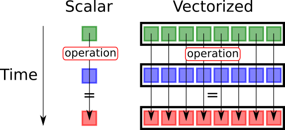
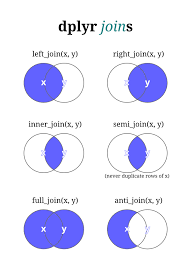

```{r setup, include=FALSE}
knitr::opts_chunk$set(echo = T, message = F, warning = F)
```

```{r, echo=F}
library(dplyr)
```

# Introducció

## Vectorització

R és molt lent.

Cada vegada que fas un loop Déu mata un gatet. 


S'ha de vectoritzar.

## Vectorització



R està pensat per vectoritzar sempre que es pugui.

## Exemple {.smaller}

```{r}
vec <- rnorm(5, 50, 10)
```

Vull multiplicar per 2:

Loop:

```{r}
for (a in vec) {
 print(a * 2)
}
```

Vectoritzat:

```{r}
vec * 2
```

## Exemple 2

Tinc un dataframe:

```{r}
df <- data.frame(a = rbinom(10, 5, .2), b = rbinom(10, 5, .7))
head(df)
```

## Exemple 2

Vull fer c que sigui la suma dels dos:

Loop:

```{r}
df$c <- NULL
for (i in 1:nrow(df)) {
 df$c[i] <- df$a[i] + df$b[i]
}
```

Vectoritzat:

```{r}
df$c <- df$a + df$b
```

## Condicionals

```{r}
a <- 2
if (a > 1) {
 print("a és més gran que 1")
} else if (a == 1) {
 print("a és 1")
} else {
 print("a és més petit que 1")
}
```

## Operadors lògics

| Símbol | Descripció
|--------|:-------------:| 
|== |	Igual	|
|> | Més gran que		|
|<	| Més petit que	|
|>=	| 	Més gran o igual	|
|<=		| Més petit o igual		|
| !=	| No igual		|
|%in% | Un element es troba dins d'un vector d'elements?	|

## Exemple: dataframe

Loop: 

```{r}
df$d <- NULL
for (i in 1:nrow(df)) {
 if (df$c[i] > 5) {
   df$d[i] <- "Malalt"
 } else {
   df$d[i] <- "No malalt"
 }
}
```

Vectoritzat:

```{r}
df$d <- if_else(df$c > 5, "Malalt", "No malalt")
```


## Seleccionar amb ends_with, starts_with {.smaller}

```{r, include=F, eval=F, echo=F}
url <- "https://analisi.transparenciacatalunya.cat/resource/tasf-thgu.json"
q <- "?$where= data >= '2019-01-01' and data <= '2020-03-13'"
l <- paste0(url, q)
data <- RSocrata::read.socrata(l, stringsAsFactors = F)
aa <- data |> 
        filter(municipi %in% c("Reus", "Tarragona")) |> 
        select(-c(geocoded_column.type, geocoded_column.coordinates))
write.csv(aa, "data/contaminacio.csv", row.names = F)
```

Dades de contaminació

```{r}
library(readr)
cont <- read_csv("data/contaminacio.csv")
orig <- cont
head(cont)
```

## Seleccionar amb ends_with, starts_with {.smaller}

```{r}
cont <- cont |>
  select(data, municipi, contaminant, unitats, starts_with("h"))
cont
```

## Filtrar: filter {.smaller}

```{r}
cont |>
 filter(municipi == "Reus", contaminant == "CO", data > "2019-12-29")
```

## Filtrar: distinct {.smaller}

```{r}
nrow(cont)
```

```{r}
cont <- cont |>
 distinct()
nrow(cont)
```

## Pivotar: pivot_longer {.smaller}

```{r}
library(tidyr)
cont <- cont |>
 pivot_longer(starts_with("h"))
cont
```

## Netejar: drop_na

```{r}
cont <- cont |> 
        drop_na() 
cont
```

## Pivotar: pivot_wider {.smaller}

```{r}
wcont <- cont |> 
  distinct(data, municipi, contaminant, name, .keep_all = T) |>
  pivot_wider(names_from = contaminant, values_from = value)
wcont
```

## Agrupar i resumir: group_by i summarize {.smaller}

```{r}
wcont |>
  drop_na(CO) |>
  group_by(municipi) |>
  summarise(across(CO, mean))
```

## Agrupar i resumir: group_by i summarize {.smaller}

Sobre múltiples columnes a la vegada

```{r}
wcont |>
  drop_na(c(H2S, NO, NO2)) |>
  group_by(municipi) |>
  summarise(across(c(H2S, NO, NO2), mean))
```

## Agrupar i resumir: group_by i summarize {.smaller}

```{r}
wcont |>
  drop_na(CO) |>
  group_by(data, municipi) |>
  summarise(n = n(), m = mean(CO), sd = sd(CO))
```

## Canviar els noms: rename

```{r}
wcont |>
  rename(c(Ciutat = municipi, Hora = name, Data = data))
```

## Canviar els noms: rename_with

```{r}
library(stringr)
tt <- orig |>
  rename_with(\(x) gsub("h", "Hora - ", x, fixed = T), starts_with("h"))
names(tt)
```

## Treballar amb caràcters

```{r}
nom <- "Eudald"
```

Abans:

```{r}
print(paste("Hola, em dic ", nom, ".", sep = ""))
```

Ara:

```{r}
library(glue)
print(glue("Hola, em dic {nom}."))
```

## Treballar amb caràcters

```{r}
cont |>
  mutate(
    contaminant = glue("{contaminant} ({unitats})")
  )
```

## Dates: lubridate {.smaller}

Tinc una cadena alfanumèrica que vull convertir a data:

```{r}
dt <- "16/03/2021 12:23"
```

Abans:

```{r}
as.POSIXlt(dt, format = "%d/%m/%Y %H:%M")
```

Ara:

```{r}
library(lubridate)
dmy_hm(dt)
```

## Dates: floor_date

```{r}
wcont <- wcont |>
  mutate(Setmana = floor_date(data, "week"))
wcont
```

## Dates: floor_date

```{r}
wcont |>
  mutate(
    Setmana = glue("Setmana {week(Setmana)}")
  ) |>
  select(c(data, municipi, Setmana))
```

## Ajuntar dataframes: inner_join

Què passa si volem ajuntar dos datasets?

Agafem dades de població per municipi (que podeu trobar al fitxer municipis.xlsx)

```{r}
library(readxl)
muns <- read_excel("data/municipis.xlsx")
muns
```

```{r}
wcont <- wcont |>
        inner_join(muns, by = c("municipi" = "Municipi"))
```

## Tipus de joins



## Show off {.smaller}

```{r}
wcont |>  
  drop_na(CO) |>
  group_by("Setmana" = floor_date(data, "week"), municipi) |>
  summarise(across(CO, mean)) |> 
  rename(Ciutat = municipi) |>
  group_by(Ciutat) |>
  plotly::plot_ly(x = ~ Setmana, y = ~ CO, color = ~ Ciutat, 
                  type = 'scatter', mode = 'lines')
```

## Fi

\center
\Large

Final de la sessió 3.

