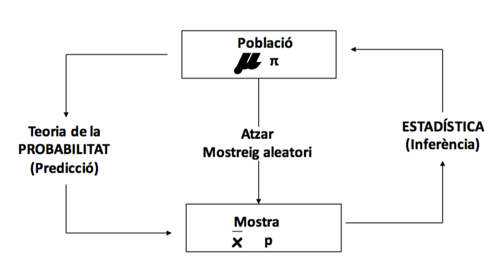
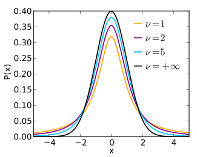
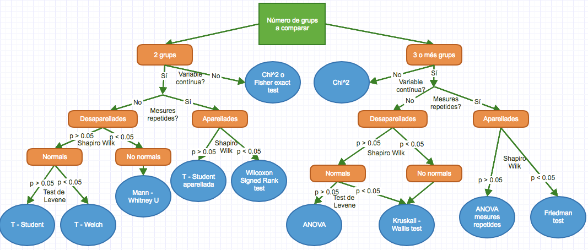

```{r setup, include=FALSE}
knitr::opts_chunk$set(echo = TRUE, message = FALSE, warning = FALSE)
set.seed(2901)

# Carregar llibreries necessàries
library(dplyr)
library(readr)
library(ggplot2)
library(glue)
library(forcats)
library(GGally)
library(haven)
library(gmodels)
library(tidyr)

# Llegir i preparar dades
dades <- read_csv("data/dades.csv", show_col_types = FALSE)
dades <- dades |> 
  mutate(
    alçada = rnorm(n(), 170, 10),
    pes = rnorm(n(), 75, 10),
    imc = pes / (alçada / 100)^2,
    imccat = case_when(
      imc < 18 ~ "Baix pes",
      imc < 25 ~ "Pes normal", 
      imc < 30 ~ "Sobrepès",
      .default = "Obesitat"
    ) |> fct_inorder()
  )
```

# Què és l'estadística



## Estadística descriptiva

# Estadística descriptiva

## Introducció

- Variables contínues:
  * mean()
  * sd()
  * range()
  * median()
  
- Variables categòriques o de text:
  * table()
  
- Tot a la vegada
  * summary()

Descriptius: variables contínues

```{r}
# Mitjana:
mean(dades$edat)

# Desviació estàndard:
sd(dades$imc)

# Rang:
range(dades$pes)

# Mediana:
median(dades$alcada)

quantile(dades$pes)
```

Descriptius: variables categòriques

```{r}
table(dades$sexe)

table(dades$sexe, dades$curacio)
```

Descriptius: funció summary()

```{r}
summary(dades)
```

- També es pot fer summary de només una o algunes variables:

```{r}
summary(dades$edat)

# Versió tidyverse amb select
dades |> 
  select(sexe, edat, alçada) |> 
  summary()
```

# Intervals de confiança

## El Teorema Central del Límit

El **Teorema Central del Límit (TCL)** és un dels resultats més importants de l'estadística. Ens diu que:

> Si agafem mostres aleatòries d'una població (independentment de la seva distribució original), la distribució de les mitjanes d'aquestes mostres tendeix a una distribució normal quan la mida de la mostra és gran.

### Simulació del Teorema Central del Límit

Per veure com funciona el TCL, podem utilitzar una simulació interactiva:

```{r, eval = FALSE}
# Executar la simulació del TCL
source("central_limit_theorem.R")
```

Aquesta simulació mostra com:
- La població original pot tenir qualsevol distribució (en aquest cas, log-normal per les rendes)
- Les mitjanes de mostres aleatòries tendeixen a una distribució normal
- Com més gran és la mida de la mostra, més normal és la distribució de les mitjanes

## Error estàndard i marge d'error

### Error estàndard

L'**error estàndard** és la desviació estàndard de la distribució de les mitjanes mostrals:

\[ SE = \frac{s}{\sqrt{n}} \]

On:
- $s$ és la desviació estàndard de la mostra
- $n$ és la mida de la mostra

### Marge d'error

El **marge d'error** depèn del nivell de confiança que volem:

\[ ME = z_{\alpha/2} \times SE \]

On $z_{\alpha/2}$ és el valor crític de la distribució normal estàndard per al nivell de confiança desitjat.

## Intervals de confiança

Un **interval de confiança** és un rang de valors que, amb una probabilitat determinada (nivell de confiança), conté el veritable valor del paràmetre poblacional.

### Fórmula general

Quan coneixem la desviació estàndard poblacional ($\sigma$):
\[ IC = \bar{x} \pm z_{\alpha/2} \times \frac{\sigma}{\sqrt{n}} \]

Quan utilitzem la desviació estàndard de la mostra ($s$):
\[ IC = \bar{x} \pm t_{\alpha/2, n-1} \times \frac{s}{\sqrt{n}} \]

On $t_{\alpha/2, n-1}$ és el valor crític de la distribució t de Student amb $n-1$ graus de llibertat.

### Per què la distribució t?

- Quan coneixem $\sigma$ (poblacional), utilitzem la distribució normal estàndard (z)
- Quan utilitzem $s$ (mostral), introduïm incertesa addicional perquè $s$ és una estimació de $\sigma$
- La distribució t té cues més pesades que la normal, reflectint aquesta incertesa addicional
- Quan $n$ és gran ($n > 30$), la distribució t s'aproxima molt a la normal

### Exemple pràctic

```{r}
# Calcular interval de confiança per a la mitjana d'edat
edat_mitjana <- mean(dades$edat)
edat_sd <- sd(dades$edat)
n <- nrow(dades)

# Error estàndard
se_edat <- edat_sd / sqrt(n)

# Marge d'error amb distribució t (95% de confiança)
# qt(0.975, n-1) per 95% de confiança (2.5% a cada cua)
t_critic <- qt(0.975, n-1)
me_edat <- t_critic * se_edat

# Interval de confiança
ic_inferior <- edat_mitjana - me_edat
ic_superior <- edat_mitjana + me_edat

cat("Mitjana d'edat:", round(edat_mitjana, 2), "\n")
cat("Desviació estàndard:", round(edat_sd, 2), "\n")
cat("Mida de mostra:", n, "\n")
cat("Error estàndard:", round(se_edat, 2), "\n")
cat("Valor crític t (95%):", round(t_critic, 3), "\n")
cat("Marge d'error (95%):", round(me_edat, 2), "\n")
cat("Interval de confiança 95%: [", round(ic_inferior, 2), ", ", round(ic_superior, 2), "]", sep = "")

# Comparació amb z (per veure la diferència)
z_critic <- 1.96
me_edat_z <- z_critic * se_edat
cat("\n\nComparació amb distribució normal (z = 1.96):")
cat("\nMarge d'error amb z:", round(me_edat_z, 2))
cat("\nDiferència:", round(me_edat - me_edat_z, 3))
```

### Interpretació

- **95% de confiança**: Si repetíssim l'estudi moltes vegades, el 95% dels intervals calculats contindrien el veritable valor de la mitjana poblacional.
- **No significa**: Hi ha un 95% de probabilitat que la mitjana poblacional estigui en aquest interval.

### Factors que afecten l'amplitud de l'interval

1. **Mida de la mostra**: Com més gran és $n$, més petit és l'interval
2. **Variabilitat**: Com més gran és $s$, més gran és l'interval
3. **Nivell de confiança**: Com més alt és el nivell de confiança, més gran és l'interval

```{r}
# Comparar intervals per diferents nivells de confiança (utilitzant t)
nivells_confianca <- c(0.90, 0.95, 0.99)
probabilitats <- c(0.95, 0.975, 0.995)  # Per 2.5%, 2.5% i 0.5% a cada cua

cat("Intervals de confiança utilitzant distribució t:\n")
for(i in 1:length(nivells_confianca)) {
  t_critic <- qt(probabilitats[i], n-1)
  me <- t_critic * se_edat
  ic_inf <- edat_mitjana - me
  ic_sup <- edat_mitjana + me
  
  cat("Nivell de confiança", nivells_confianca[i]*100, "% (t =", round(t_critic, 3), "): [", 
      round(ic_inf, 2), ", ", round(ic_sup, 2), "]\n")
}

# Comparació amb z per mostres grans
cat("\nComparació amb z (vàlid només per mostres grans, n > 30):\n")
z_valors <- c(1.645, 1.96, 2.576)
for(i in 1:length(nivells_confianca)) {
  me_z <- z_valors[i] * se_edat
  ic_inf_z <- edat_mitjana - me_z
  ic_sup_z <- edat_mitjana + me_z
  
  cat("Nivell de confiança", nivells_confianca[i]*100, "% (z =", z_valors[i], "): [", 
      round(ic_inf_z, 2), ", ", round(ic_sup_z, 2), "]\n")
}
```


# Tests d'hipòtesi

- Creem hipòtesis nules (H0) i les intentem refutar per tal d'acceptar la hipòtesi alternativa
- Quan les podem refutar?
    - Depèn de l'error tipus I (sovint en 5%)
- **Quan la probabilitat de que la mostra vingui d'una distribució que segueix la hipòtesi nul·la sigui menor que 1 menys l'error tipus I**
    - Si l'error tipus I és del 5% serà quan la p < 0.05

## Exemple 1

Tenim una pastilla per baixar el colesterol i un placebo, volem demostrar que la pastilla funciona i per tant hem de demostrar que els nivells de colesterol del grup que han pres la pastilla són significativamet més baixos que els que no han pres la pastilla.

```{r}
# Simulem les dades:
colesterol <- c(rnorm(20, mean = 85, sd = 10), rnorm(20, mean = 95, sd = 14))
grup <- c(rep("tractament", 20), rep("placebo", 20))

tibble(
  colesterol = as.numeric(colesterol),
  grup = fct_inorder(grup)
) |> 
  ggplot(aes(x = grup, y = colesterol)) +
  geom_boxplot() +
  geom_jitter(width = 0.2, alpha = 0.6) +
  labs(
    y = "Colesterol", 
    title = "Comparació tractament-placebo"
  ) +
  theme_minimal()
```

**La pastilla funciona?**

## Exemple 2 

Assumim que la mitjana d'alçada d'aquesta classe és de 170cm i la desviació estàndard és de 10cm, quina probabilitat hi ha que entri per la porta una persona de 195cm?

## Com es resol?

Per respondre a aquestes preguntes hem de saber les probabilitats que hi ha de que aquestes mostres provinguin d'una població que compleix la hipòtesi nul·la. 

És a dir, en el cas del colesterol, hem de calcular la probabilitat de que trobem els valors observats en el cas de que la pastilla no tingui cap efecte. O dit d'una altra manera, la probabilitat de que les diferències que veiem siguin causades únicament per l'atzar. 

En el cas de l'alçada, hem de calcular les probabilitats de que una persona provinent de la mateixa població que nosaltres (investigadors, del camp, etc) tingui una alçada de 195cm.

### Com calculem aquesta probabilitat?

Per saber-ho hem de **tipificar** les mostres per trobar l'*estadístic de contrast*, és a dir, convertir els valors que tinc a una distribució coneguda, per tal de que pugui saber les probabilitats de que la meva mostra fos com a tal tot i provindre d'una població que segueix la hipòtesi nul·la. 

**Mostra -> Distribució -> Posició en la distribució -> Probabilitat (p)**

Com es tipifica?

- Depèn de la condició: en cada anàlisi hauré d'escollir una distribució i una "fórmula" per transformar les meves dades a aquella distribució.

Per exmeple, si assumim que les mostres de colesterol són normals i tenen variàncies homogènies, en el primer exemple el nostre estadístic de contrat és la t, que és un valor de la distribució T:



Hem de colocar l'estadístic de contrast calculat amb les nostres dades en aquesta distribució i mirar a les taules les probabilitats de que el valor estigui on és, és a dir, l'àrea sota la corba més cap a fora del nostre punt (els valors més extrems del nostre punt).

La fórmula per calcular l'estadístic de contrast en aquest cas és: 

\[ t = \frac{\bar{x_A}-\bar{x_B}}{\sqrt{\frac{s_{conj}}{n_A}+\frac{s_{conj}}{n_B}}} \]

Que, amb les nostres dades, dóna: \[ t = 1.856 \]

Busquem a les taules la probabilitat de que això es doni, amb graus de llibertat: \[n_A+n_b-2 = 38\]

[Taula de T](https://www.statisticshowto.datasciencecentral.com/tables/t-distribution-table/)

Veiem que les probabilitats estan entre el 2.5 i el 5%, així que concloem que sí que  podem abandonar la hipòtesi nul·la i acceptar que la pastilla baixa el colesterol.

En el segon cas, la tipificació és molt més senzilla:

\[ z = \frac{x-\mu}{\sigma} \]

Que, en el nostre cas val: \[ z= 2.5 \]

En aquest cas mirem a les taules de la distribució normal:

[Taula de Z](http://www.z-table.com/)

Per tant veiem que la probabilitat de que entri algú de 195cm o més és del 0,62%.

Per tant, veiem que sempre és el mateix:

Això ho condensem amb els *tests d'hipòtesi*, que fan tot aquest procediment d'una tirada:

Test d'hipòtesi <-> Mostra -> Distribució -> Posició en la distribució -> Probabilitat (p)

Ara la pregunta és: quin test d'hipòtesi he de fer servir?

### Tests d'hipòtesi



I taules!

Test | Comanda 1 | Comanda 2
-------------------- | ---------------------- | ---------------------
Chi 2 | chisq.test(x, y) | 
Fisher exact test | fisher.test(x, y) | 
Shapiro Wilk | shapiro.test(x) |
Levene | var.test(x, y) | levene.test(y, group) 
T - Student | t.test(x, y, var.equal = TRUE) | t.test(formula, data, var.equal = TRUE)
T - Welch | t.test(x, y) | t.test(formula, data)
Mann-Whitney U | wilcox.test(x, y) | wilcox.test(formula, data)
T - Welch aparellada | t.test(x, y, paired = TRUE) | t.test(formula, data, paired = TRUE)
Wilcoxon Signed Rank | wilcox.test(x, y, paired = TRUE) | wilcox.test(formula, data, paired = TRUE)
ANOVA | aov(formula, data) |
Kruskall Wallis | kruskal.test(x, g) | kruskal.test(formula, data)
ANOVA mesures repetides | ez::ezANOVA(data, dv, wid) |
Friedman | friedman.test(y, groups) | friedman.test(formula, data)

# Contrastos d'hipòtesis 

## Introducció

1. Volem verificar si es compleix una hipòtesis sobre un conjunt de dades.

- Hipòtesis nul·la (H$_0$):

- Hipòtesis alternativa (H$_1$):

2. Estadístic de contrast (sota la H$_0$)

3. Valor observat del estadístic de contrast.

4. Valor p: Si la H$_0$ és certa, probabilitat d'observar una diferència/ un valor igual o més extrem.

## Dades de mostra

Per mostrar els contrastos d'hipòtesi utilitzarem el següent conjunt:

```{r, message = FALSE}
fitxer <- "data/pulse2sa.sav"
dades_pulse <- read_sav(fitxer)
head(dades_pulse)
```

# Constrastar la normalitat

## Test de shapiro-wilk:

H$_0$: variable ~ distribució normal

H$_1$: variable no segueix distribució normal

La funció en R és:

```{r, eval = FALSE}
shapiro.test(x)
```

On x és un vector numèric.

Exemple:

```{r, message = FALSE, warning = FALSE}
shapiro.test(dades_pulse$HEIGHT)
```

## Comprovació visual

- És interessant fer gràfics per comprovar la normalitat de forma visual.
- Serveix, per exemple, per assegurar-nos d'haver fet bé el test de Shapiro.
- Hi ha principalment dos gràfics que ens ajudaran a veure la normalitat.
- Histograma: dibuixa les freqüències agrupades segons els resultats.
- Dibuixem l'histograma amb la funció hist().
- qqplot: dibuixa els quantils de la mostra en comparació amb quantils teòrics que segueixin una distribució normal.
- Dibuixem el qqplot amb la funció qqnorm() i qqline() opcionalment per afegir una línia que marca la normal.

## Comprovació visual: histograma

```{r, fig.height = 5}
# Versió base R
hist(dades_pulse$HEIGHT)

# Versió tidyverse amb ggplot2
dades_pulse |> 
  ggplot(aes(x = HEIGHT)) +
  geom_histogram(bins = 20, fill = "steelblue", alpha = 0.7) +
  labs(
    title = "Histograma de l'alçada",
    x = "Alçada",
    y = "Freqüència"
  ) +
  theme_minimal()
```

## Comprovació visual: qqplot

```{r fig2, fig.height = 5}
# Versió base R
qqnorm(dades_pulse$HEIGHT) # Dibuixa els punts
qqline(dades_pulse$HEIGHT) # Dibuixa una línia que marca la normal

# Versió tidyverse amb ggplot2
dades_pulse |> 
  ggplot(aes(sample = HEIGHT)) +
  geom_qq() +
  geom_qq_line() +
  labs(
    title = "Q-Q Plot de l'alçada",
    x = "Quantils teòrics",
    y = "Quantils observats"
  ) +
  theme_minimal()
```

# Comparació de mitjanes

## Test - T

- Respecte una mitjana ($\mu$) de referència

H$_0$: $\mu$= $\mu_0$

H$_1$: $\mu$ $\neq$ $\mu_0$

La funció en R és:

```{r, eval = FALSE}
t.test(x,          #  vector numèric
       y = NULL,   #  segon vector numèric, en cas de que en vulguem comparar 2
       alternative = c("two.sided", "less", "greater"), #  T d'Student bivariada o
       # univariada per l'esquerra o per la dreta
       mu = 0,     #  mitjana real, en cas de que vulguem comparar un vector x 
       # amb una mitjana donada
       paired = FALSE, #  dades aparellades
       var.equal = FALSE, #  homogeneïtat de variàncies (per defecte considera que 
       # les variàncies NO són homogènies i fa el test de Welch)
       conf.level = 0.95, #  nivell de confiança
       ... #  altres arguments
       )
```

## Comparació de mitjanes

També es pot donar en forma de funció:

```{r, eval = FALSE}
t.test(x ~ y ,  #  x és un vector numèric i y categòric
       data, #  el dataframe del qual traiem les dades
       ... #  els mateixos arguments que abans
       )
```

Exemple:

- Comoparar un conjunt amb una mitjana poblacional coneguda.

```{r, message = FALSE, warning = FALSE}
t.test(dades_pulse$WEIGHT, mu = 70)
```

## Interval de confiança

- La funció t.test, així com les que veurem a continuació, també ens donen l'interval de confiança.
- En l'exmeple anterior amb una confiança del 95% podem dir que la mitjana es troba entre 63.9 i 69.6.
- Veiem que correspon amb la p, ja que el 70 no està dins l'interval i per tant la mitjana és significativamet diferent a aquest valor.
- En els propers exemples fixeu-vos que sempre rebem un interval de confiança d'allò que estem analitzant.

Exemple:

Test-t: comparació de dues mitjanes amb variàncies heterogènies

H$_0$: $\mu$= $\mu_0$ \hspace{2cm} H$_0$: $\mu$$\leq$ $\mu_0$

H$_1$: $\mu$ $\neq$ $\mu_0$ \hspace{2cm} H$_1$: $\mu$ > $\mu_0$      

```{r, message = FALSE, warning = FALSE}
t.test(WEIGHT ~ TRT, dades_pulse) 
```

Exemple:

Test-t: comaparació de dues mitjanes amb variàncies homogenies

H$_0$: $\mu$= $\mu_0$ \hspace{2cm} H$_0$: $\mu$$\leq$ $\mu_0$

H$_1$: $\mu$ $\neq$ $\mu_0$ \hspace{2cm} H$_1$: $\mu$ > $\mu_0$      

```{r, message = FALSE, warning = FALSE}
t.test(HEIGHT ~ TRT, dades_pulse, var.equal = TRUE)
```

Dades aparellades:

H$_0$: $\mu_1$ - $\mu_2$ = 0

H$_1$: $\mu_2$ - $\mu_2$ $\neq$ 0

```{r, message = FALSE, warning = FALSE}
t.test(dades_pulse$PULSE1, dades_pulse$PULSE2, paired = TRUE) # dades aparellades
```

# Comparació de variàncies

H$_0$: $\sigma_1$ / $\sigma_2$ = 1

H$_1$: $\sigma_1$/ $\sigma_2$  $\neq$ 1

```{r, eval = FALSE}
var.test(x, y, #  els dos vectors a comparar
         ratio = 1, #  valor esperat per l'hipòtesi 0 de la relació entre variàncies
         alternative = c("two.sided", "less", "greater"), #  bivariat o univariat
         conf.level = 0.95, #  nivell de confiança
         ... #  altres arguments
         )
```

Exemple:

```{r, message = FALSE, warning = FALSE}
var.test(WEIGHT ~ TRT, dades_pulse)
```

# Comparació de medianes (no paramètric)

## Wilcoxon-Mann-Whitney test

H$_0$: Mediana$_1$ = Mediana$_2$

H$_1$: Mediana$_1$ $\neq$ Mediana$_2$

La funció en R és: 

```{r, eval = FALSE}
wilcox.test(x,          #  vector numèric
            y = NULL,   #  segon vector numèric, en cas de que en vulguem comparar 2
            alternative = c("two.sided", "less", "greater"), #  T d'Student bivariada o univariada per l'esquerra o per la dreta
            mu = 0,     #  mitjana real, en cas de que vulguem comparar un vector x amb una mitjana donada
           paired = FALSE, #  dades aparellades
           var.equal = FALSE, #  homogeneïtat de variàncies (per defecte fa considera que les variàncies NO són homogènies i fa el test de Welch)
           conf.level = 0.95, #  nivell de confiança
           ... #  altres arguments
           )
```

També es pot donar en forma de funció:

```{r, eval = FALSE}
wilcox.test(x ~ y ,          #  x és un vector numèric i y categòric
            data, #  el dataframe del qual traiem les dades
            ... #  els mateixos arguments que abans
            )
```

Exemple

```{r, message = FALSE, warning = FALSE}
wilcox.test(PULSE1 ~ TRT, data = dades_pulse)
```

Dades aparellades

y = x1 - x2

H$_0$: Mediana$_y$ = 0

H$_1$: Mediana$_y$ $\neq$ 0

```{r, message = FALSE, warning = FALSE}
wilcox.test(dades_pulse$PULSE1, dades_pulse$PULSE2, paired = TRUE)
```

# Taules de contingència

## Chi quadrat

H$_0$: Variables independents

H$_1$:Variables no independents

Per comparar dues variables categòriques fem servir el test de Chi^2, que en R és:

```{r, eval = FALSE}
chisq.test(x, #  vector 1 a comparar
           y = NULL, #  vector 2 a comparar
           simulate.p.value = FALSE, #  simular el valor p, 
           # s'utilitza en mostres petites
           ... #  altres arguments
           )
```

Exemple:

```{r, message = FALSE, warning = FALSE}
chisq.test(dades_pulse$SMOKES, dades_pulse$TRT)
```

Test exacte de Fisher en R:

```{r, eval = FALSE}
fisher.test(x, y = NULL, #  els dos vectors categòrics a comparar
            alternative = "two.sided", #  bivariat o univariat
            conf.int = TRUE,  #  volem que mostri els intervals de confiança?
            conf.level = 0.95,   #  nivell de confiança
            simulate.p.value = FALSE, #  simular el valor p, usat en mostres petites
            ... #  altres arguments
            )
```

Exemple:

```{r, message = FALSE, warning = FALSE}
fisher.test(dades_pulse$SMOKES, dades_pulse$TRT)
```

Funció útil: CrossTable (paquet gmodels)

```{r}
CrossTable(dades_pulse$SMOKES, dades_pulse$TRT, chisq = TRUE, fisher = TRUE)
```

## Exemples:

Anem a veure com s'utilitzen. Seguim amb el fitxer de malalties del fetge.

Quines dades teníem?

```{r}
liver <- read_csv('data/indian_liver_patient.csv')
```

```{r}
head(liver)
```

```{r}
glimpse(liver)
```

```{r}
# Canviem el nom i formategem la variable d'interès
liver <- liver |> 
  rename(Malaltia = Dataset) |> 
  mutate(
    Malaltia = case_when(
      Malaltia == 1 ~ "No malalt",
      Malaltia == 2 ~ "Malalt"
    ) |> fct_inorder(),
    Gender = as_factor(Gender)
  )
```

Comprovem que ho hem fet bé:

```{r}
glimpse(liver)
```

Imaginem que volem veure si la bilirrubina total depèn segons el sexe: 

Primer mirem si segueix una distribució normal:

```{r}
shapiro.test(liver$Total_Protiens)
```

No té una distribució normal, per tant hem de fer una U de Mann - Whitney:

```{r}
wilcox.test(Total_Protiens ~ Gender, data = liver)
```

La p < 0.05 per tant hem rebutgem la hipòtesi nula i assumim que els nivells de "Total_Protiens" són diferents entre homes i dones (en concret més alts pels homes).

Això és veritat?

```{r}
liver |> 
  ggplot(aes(x = Gender, y = Total_Protiens)) +
  geom_boxplot() +
  geom_jitter(width = 0.2, alpha = 0.5) +
  labs(
    title = "Total de proteïnes per gènere",
    x = "Gènere",
    y = "Total de proteïnes"
  ) +
  theme_minimal()
```

Visualment sembla que potser sí, tot i que no està del tot clar. 

Què passa si assumim normalitat?

```{r}
t.test(Total_Protiens ~ Gender, data = liver)
```

Gairebé el mateix!

Provem amb una altra variable:

```{r}
wilcox.test(Albumin_and_Globulin_Ratio ~ Gender, data = liver)
```

A veure?

```{r}
liver |> 
  ggplot(aes(x = Gender, y = Albumin_and_Globulin_Ratio)) +
  geom_boxplot() +
  geom_jitter(width = 0.2, alpha = 0.5) +
  labs(
    title = "Ràtio albumina i globulina per gènere",
    x = "Gènere",
    y = "Ràtio albumina i globulina"
  ) +
  theme_minimal()
```

Ara volem veure si estadísticament la malaltia afecta més a homes o a dones:

```{r}
# Crear taula de contingència amb tidyverse
liver |>
  count(Gender, Malaltia) |>
  pivot_wider(names_from = Malaltia, values_from = n)

# Test chi-quadrat
chisq.test(liver$Gender, liver$Malaltia)
```

Justet però sembla que no!

Ho podem fer també amb la nostra taula creuada amb tot integrat:

```{r}
CrossTable(liver$Gender, liver$Malaltia, chisq = TRUE, fisher = TRUE)
```

## Correlacions

I les Albumines i els Total_Protiens estan correlacionats?

```{r}
cor.test(liver$Albumin, liver$Total_Protiens, method = "spearman")
```

Clarament sí! Anem a veure-ho:

```{r}
liver |> 
  ggplot(aes(x = Albumin, y = Total_Protiens)) +
  geom_point(alpha = 0.6) +
  geom_smooth(method = "lm", se = FALSE) +
  labs(
    title = "Correlació entre Albumina i Total de Proteïnes",
    x = "Albumina",
    y = "Total de proteïnes"
  ) +
  theme_minimal()
```

```{r, fig.width = 12, fig.height = 12}
ggpairs(liver)
```

Veient aquest gràfic, ens trobem que hi ha moltes mesures que estan molt escorades a l'esquerra; això passa molt sovint en medicina i s'ha de mirar d'arreglar. Això se sol fer traient el logaritme de la variable, en R és molt senzill:

```{r, fig.width = 12, fig.height = 12}
liver |>
  mutate(
    across(
      c(
        Total_Bilirubin,
        Direct_Bilirubin,
        Alkaline_Phosphotase,
        Alamine_Aminotransferase,
        Aspartate_Aminotransferase
      ),
      log1p # log1p(x) = log(x + 1)
    )
  ) |> 
  ggpairs()
```
